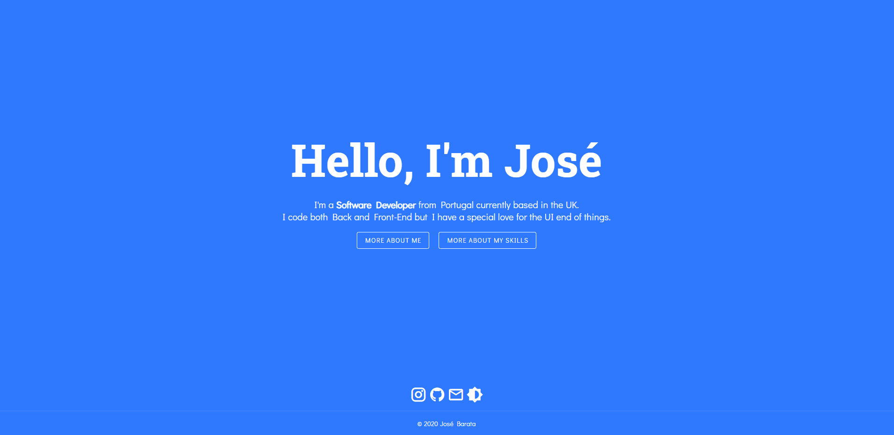

# vue-personal-website

- I've made a website (nuxt/vue) for my personal use. Feel free to copy it and use it for yourself if you need it 
- @nuxtjs/vuetify 
- Light and dark themes available 
- Clarity Design System 

## Try it

Clone it. Run `npm i` followed by `npm run dev` for a dev server. Navigate to `http://localhost:3000/`. The app will automatically reload if you change any of the source files.
